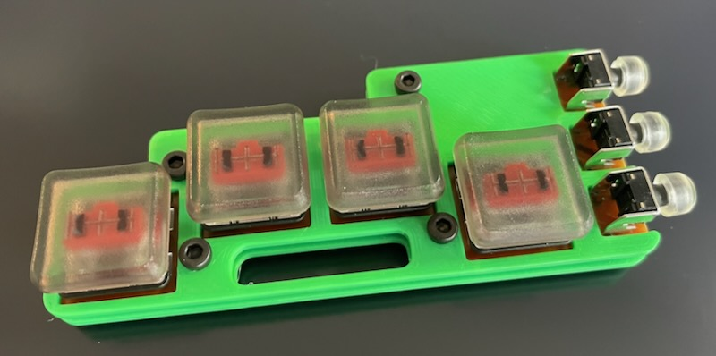
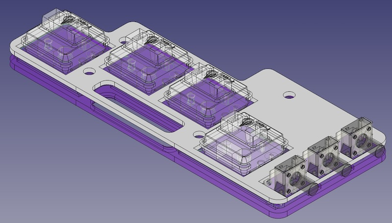
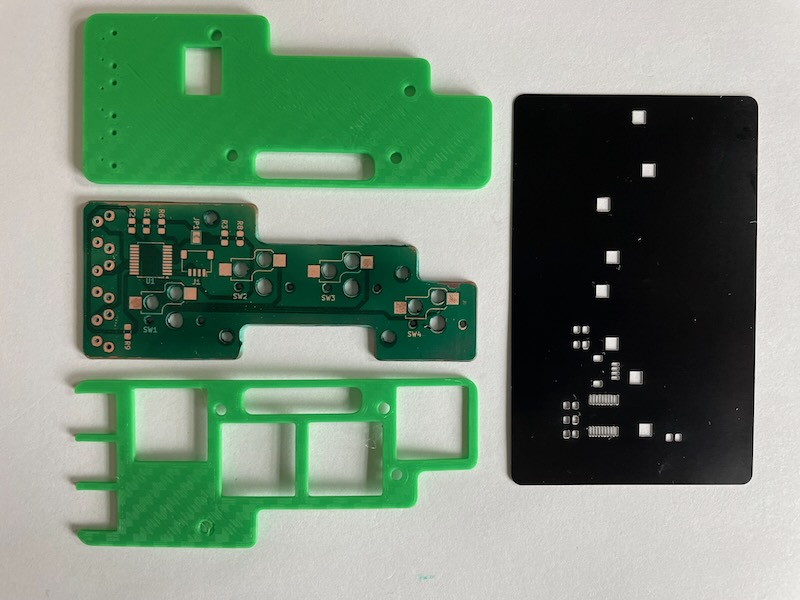

# c7k

c7k
===

Chording 7 Key - I2C breakout

Ultra-Thin interface designed for maximum portability. One handed keybaord which can be used behind a phone, tablet a carried in the pocket. A full size keybaord in seven buttons.

I2C interface means easy connectivity to modern micrcontrollers and single board computers. This allows maximum flexibility for direct to controller, HID USB or HID BLE interfacing.

